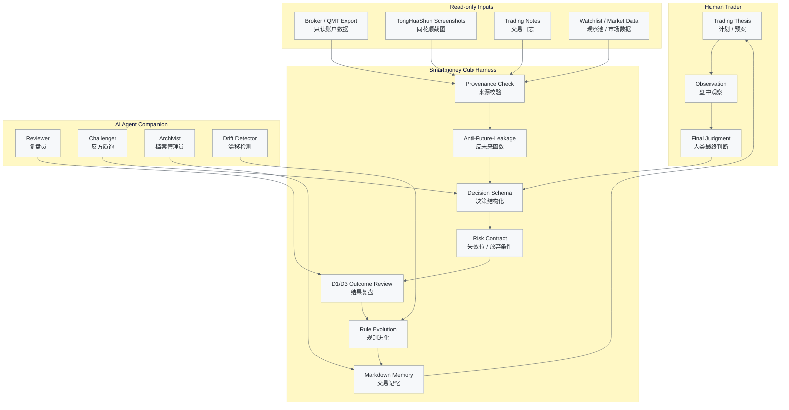

# smartmoney-cub-harness

[](https://www.python.org/)
[](LICENSE)
[](tests/)
[](docs/safety.md)
[](docs/safety.md)
[](docs/harness-contract.md)
[](docs/agent-integration.md)

AI decision harness for subjective A-share traders.  
Read-only. Human-in-the-loop. Built for review, discipline, and rule evolution.

**聪明资金幼年体 / 游资幼年体：陪你复盘，不替你下单。**  
**把“小资金做大的神话”，拆成每天可记录、可验证、可进化的交易系统。**

**Not a stock-picking bot. A semi-quant AI decision harness where human traders and agents evolve through evidence.**

## Safety & Disclaimer

This project is for research, journaling, review, and educational workflow design only. It is not financial advice, not a stock recommendation service, not price prediction, and not a trading execution system. Any account, screenshot, or trading-record input is used only for local review and structured analysis.

Every manifest, decision, outcome, evaluation, registry, and doctor output carries:

```text
READ_ONLY_NO_ORDER_NO_CANCEL_NO_TRADE
```

## The Story

很多人都听过 A 股江湖里“小资金做大”的神话。

有人记住了龙头，有人记住了情绪，有人记住了分歧转一致，有人记住了“高手买入龙头，超级高手卖出龙头”。但真正难的不是背下这些语录，而是在自己的账户里，把每一次冲动、犹豫、误判、错过、格局和撤退，变成可以复盘的证据链。

`smartmoney-cub-harness` 想做的不是一个告诉你明天买什么的机器人。它是一只还在长大的“聪明资金幼年体”：它只读你的账户导出、截图、日志或 toy data，只记录你的计划和证据，只在结果出来之后和你一起复盘。

It does not ask "what is tomorrow's winner?" It asks:

- Why did you act at that time?
- Where was the invalidation point?
- Was this a repeatable pattern, or luck?
- Did the cycle offer opportunity, or did emotion take over?
- After D1/D3 review, should this rule be promoted, downgraded, or deleted?

In the AI era, good review does not have to depend on randomly meeting a mentor. A large model can become a sparring partner, challenger, reviewer, archivist, and systems-engineering assistant. But your pattern still has to grow out of your own feedback loop.

## What It Is

- A subjective trading decision harness.
- A read-only account/screenshot review companion.
- A trading journal with provenance and invalidation discipline.
- A D1/D3 outcome review engine.
- A rule evolution loop.
- An agent-ready review framework.
- A personal pattern discovery system.
- A semi-quantitative bridge between human discretion and machine-audited review.

## What It Is Not

- Not a quantitative alpha factory.
- Not a single trading strategy.
- Not a stock-picking bot.
- Not a signal-selling system.
- Not a broker or execution bot.
- Not an automated trading system.
- Not financial advice.
- Not a promise that small capital will grow large.

## Account & Screenshot Input

`smartmoney-cub-harness` can work with different levels of input:

- Read-only broker/account export.
- Read-only QMT or adapter integration if configured locally.
- Trading journal CSV.
- Watchlist files.
- TongHuaShun or broker screenshots of positions, orders, and daily review.
- Manually written trading notes.

All inputs are for review and journal generation only. The public core does not connect to live execution by default. It does not place orders, cancel orders, or modify accounts.

Screenshots are often the safer path for ordinary users: lower setup cost, smaller permission surface, and less chance of confusing review with execution. Even without an API, you can provide position screenshots, broker fill screenshots, and trading-plan text; the harness can still act as an AI review partner that structures the plan, risk, invalidation, and later outcome.

哪怕你没有 API，也可以把同花顺持仓截图、券商成交截图、交易计划文本丢给它，它依然可以作为 AI 复盘陪练，帮你整理当时的计划、风险、失效位和后续结果。

## Core Loop



## Where the 易经 Thinking Lives

This project does not use 易经 as fortune telling, symbol prediction, or price forecasting. The useful engineering translation is a review language for cycle, timing, position, change, restraint, and opposing evidence.

| 易经思想 | Harness module | Engineering meaning |
| --- | --- | --- |
| Market Regime / Sentiment Cycle | `decision.json`, outcome tags, Markdown memory | Label whether the market felt like early probing, mainline growth, crowded acceleration, widening divergence, or retreat/waiting. |
| Timing & Position | `decision_time`, `available_at`, D1/D3 horizon | Ask not only "can this pattern work?" but "where is it inside the current cycle?" |
| Change vs Invariance | `manifest.py`, `evaluator.py`, `registry.py` | Themes, leaders, emotion, and preferences change; risk boundaries, review, invalidation, discipline, and sample validation stay. |
| Advance / Retreat / Restraint | `WATCH`, `AVOID`, `EMPTY_POSITION`, risk contract | When the state is unsupported, the system should record restraint. Empty position is also a decision. |
| Opposing Evidence | Agent challenger prompts and failure tags | Every bullish thesis should generate an opposing thesis so the trader does not collect only confirming evidence. |

The retreat phase matters. In a cooldown or drawdown state, the goal is not offense; it is preserving the right to act next time.

## Where Systems Engineering Lives

Qian Xuesen-style systems engineering appears here as modules and loops, not decorative philosophy.

| Systems engineering idea | Harness module | Engineering meaning |
| --- | --- | --- |
| Goal Tree | Future goal records, review notes, rule registry | Separate annual goals, monthly goals, single-trade goals, and review goals; do not define the system by one win or loss. |
| Decomposition & Integration | `manifest`, `decision`, `outcome`, `evaluation` | Break market state, theme, recognizability, position, risk, psychology, and outcome into inspectable fields, then integrate them into decision/evaluation artifacts. |
| Feedback Loop | Plan -> Observe -> Decide -> Record -> Outcome -> Evaluate -> Evolve | Review happens after evidence arrives, not during emotional heat. |
| Human-Machine Collaboration | `docs/agent-integration.md` | Human makes final judgment; AI challenges, structures, archives, reviews, and detects drift. |
| Qualitative-to-Quantitative Review | D1/D3 outcomes and challenger -> champion registry | Subjective judgment becomes structured, then scored, then eligible for rule promotion only after evidence. |

## Not Quant Trading. Not Pure Discretion. A Semi-Quant AI Decision Harness.

Traditional quant systems usually define a strategy first, backtest historical data, seek repeatable signals, and may automate execution. `smartmoney-cub-harness` starts from subjective trading experience and makes that experience auditable.

| Dimension | Traditional Quant System | smartmoney-cub-harness |
| --- | --- | --- |
| Starting point | Strategy definition and historical data | Human decision, thesis, context, and evidence chain |
| Main question | Does this signal repeat? | Why did I act, and did the evidence later support it? |
| Execution | May automate | Never executes; read-only review only |
| Strategy shape | Relatively fixed | Evolves through D1/D3 review and rule governance |
| AI role | Often signal generation or optimization | Challenger, reviewer, archivist, drift detector |
| Output | Signal, portfolio, backtest metrics | Manifest, decision, outcome, evaluation, memory, rule candidate |
| Human role | Often reduced | Preserved and made inspectable |

It is not the strategy itself. It is the container where a strategy grows up. It does not replace the trader; it trains the trader. It does not remove human experience; it makes that experience recordable, reviewable, and iterable.

## Human × Agent Co-Evolution

AI is not an oracle. In this harness, an agent is a training partner that helps you ask the opposing question, review delayed outcomes, archive evidence, notice rule drift, and extract patterns from logs.

The human remains responsible for final judgment.

> The edge is not inside the model. The edge emerges from the feedback loop between the trader, the market, and the memory of past decisions.

## Quick Start

```bash
git clone https://github.com/myc0576/smartmoney-cub-harness.git
cd smartmoney-cub-harness
python -m pip install -e .
smcub doctor
smcub capture-run --mode after-close --sandbox --decision-time "2026-06-01T15:30:00+08:00" --command "python examples/toy_strategy/leader_pullback_demo.py"
smcub build-outcome tmp/sandbox/20260601/20260601_153000-after-close --horizon d1 --price-source examples/toy_strategy/sample_prices.json
smcub evaluate-run tmp/sandbox/20260601/20260601_153000-after-close --horizon d1
```

The fixed decision time above creates the shown sandbox path in a clean checkout. Local absolute paths are redacted from CLI JSON output, so choose another decision time before repeating the exact sequence.

## Demo Output

Toy decision:

```json
{
  "schema": "smartmoney_cub_decision.v1",
  "action_label": "ALERT",
  "symbol": "TOY.CUB",
  "invalidation_price": 9.4,
  "time_stop": "D1/D3 review",
  "give_up_conditions": [
    "observation thesis is no longer supported by recorded evidence",
    "price below invalidation_price 9.4000"
  ],
  "data_source": "toy_strategy",
  "available_at": "2026-06-01T15:30:00+08:00",
  "data_quality_flag": "ok",
  "safety": "READ_ONLY_NO_ORDER_NO_CANCEL_NO_TRADE"
}
```

Toy evaluation:

```json
{
  "grade": "useful_alert",
  "failure_tags": [],
  "scores": {
    "valid_contract": 1,
    "false_alert": 0,
    "missed_opportunity": 0,
    "risk_contract_violation": 0
  },
  "safety": "READ_ONLY_NO_ORDER_NO_CANCEL_NO_TRADE"
}
```

## Development Checks

```bash
python -m pip install -e ".[dev]"
pytest -q
python -m smartmoney_cub_harness.cli doctor
python -m smartmoney_cub_harness.cli --help
```

## Contributing

Contributions are welcome when they preserve the safety contract. Keep examples offline and toy-only. Do not add live trading execution, broker automation, order placement, order cancellation, account modification, private watchlists, credentials, cookies, local absolute paths, or personal trading records.

## License

MIT. See [LICENSE](LICENSE).

## Safety & Disclaimer

This project is for research, journaling, review, and educational workflow design only. It is not financial advice, not a stock recommendation service, not price prediction, and not a trading execution system. Any account, screenshot, or trading-record input is used only for local review and structured analysis.
