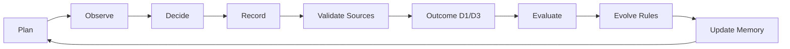

# smartmoney-cub-harness

[](https://www.python.org/)
[](LICENSE)
[](tests/)
[](docs/safety.md)
[](docs/safety.md)
[](docs/harness-contract.md)
[](docs/agent-integration.md)

A read-only AI trading companion harness for decision logging, outcome review, and rule evolution.

**聪明资金幼年体 / 游资幼年体：陪你复盘，不替你下单。**

**Not a stock-picking bot. A read-only harness where human traders and AI agents evolve together.**

## Safety & Disclaimer

This project is for research, journaling, and educational workflow design only. It is not financial advice, not investment research, not a stock recommendation service, and not a trading execution system. It does not place, cancel, or modify orders.

Every manifest, decision, outcome, evaluation, registry, and doctor output carries:

```text
READ_ONLY_NO_ORDER_NO_CANCEL_NO_TRADE
```

## Why This Exists

Many traders have heard stories about small capital growing into something much larger. The hard part is not hearing the story. The hard part is breaking the judgment, discipline, mistakes, cycle awareness, and human training behind the story into an evidence chain that can be reviewed every day.

`smartmoney-cub-harness` is not trying to be a recommendation machine. It is a young "smart money cub" that only reads and records. It logs plans, observations, decisions, invalidation levels, give-up conditions, data provenance, and D1/D3 outcomes. Later, it asks the uncomfortable review questions: was this pattern real, or just luck? Did the rule evolve, or did emotion take over?

In the AI era, a trader no longer has to review alone. A large model can become a sparring partner, reviewer, challenger, archivist, and drift detector. The final judgment still belongs to the human. The edge has to grow out of the loop.

This is not about copying someone else's leader-playbook. It is about finding your own verifiable pattern. It is not about worshiping a market proverb. It is about forcing every proverb through samples, outcomes, and risk boundaries. The myth of growing small capital, if it is useful at all, points back to discipline, feedback, and compounding cognitive iteration.

## What It Is

- Read-only trading companion harness.
- Decision logger.
- Provenance validator.
- Anti-future-leakage checker.
- D1/D3 outcome reviewer.
- Rule evolution loop.
- Agent integration scaffold.
- Personal trading pattern lab.

## What It Is Not

- Not a stock picker.
- Not a signal seller.
- Not a broker.
- Not an execution bot.
- Not financial advice.
- Not a promise of profit.
- Not a replacement for judgment.

## Core Loop



- **Plan**: write down the pre-trade premise.
- **Observe**: observe the market in read-only mode.
- **Decide**: record the decision; never automate execution.
- **Record**: preserve an evidence chain.
- **Validate**: check data time and quality to block future leakage.
- **Outcome**: evaluate only after D1/D3 evidence exists.
- **Evolve**: promote rules through challenger -> champion governance.
- **Memory**: build portable Markdown memory from reviewed decisions.

## Human × Agent Co-Evolution

AI is not an oracle. In this harness, an agent is a training partner that helps you ask the opposing question, review delayed outcomes, archive evidence, notice rule drift, and extract patterns from logs.

The human remains responsible for final judgment.

> The edge is not inside the model. The edge emerges from the feedback loop between the trader, the market, and the memory of past decisions.

## Why I Built It This Way

This architecture rests on two plain ideas: the 易经 vocabulary of change, and Qian Xuesen's systems engineering.

The useful part of 易经 here is not mysticism. It is cycle, timing, position, change, invariance, advance, retreat, and restraint. Trading is not predicting one perfect point. It is recognizing what state the market is in and whether you should act at all.

Systems engineering contributes decomposition, feedback loops, human-machine collaboration, qualitative-to-quantitative review, and integration from local observations into a larger process. A trading system is not one indicator or one prompt. It is a complex system that must be continuously checked, corrected, and evolved.

`smartmoney-cub-harness` puts those ideas into engineering practice: every judgment needs a source, every non-silent observation needs invalidation, every outcome returns to the rule, and every rule update must pass samples and review.

## Quick Start

```bash
git clone https://github.com/<OWNER>/smartmoney-cub-harness.git
cd smartmoney-cub-harness
python -m pip install -e .
smcub doctor
smcub capture-run --mode after-close --sandbox --decision-time "2026-06-01T15:30:00+08:00" --command "python examples/toy_strategy/leader_pullback_demo.py"
smcub build-outcome tmp/sandbox/20260601/20260601_153000-after-close --horizon d1 --price-source examples/toy_strategy/sample_prices.json
smcub evaluate-run tmp/sandbox/20260601/20260601_153000-after-close --horizon d1
```

The fixed decision time above creates the shown sandbox path in a clean checkout. Local absolute paths are redacted from CLI JSON output, so choose another decision time before repeating the exact sequence.

## Demo Output

Toy decision:

```json
{
  "schema": "smartmoney_cub_decision.v1",
  "action_label": "ALERT",
  "symbol": "TOY.CUB",
  "invalidation_price": 9.4,
  "time_stop": "D1/D3 review",
  "give_up_conditions": [
    "observation thesis is no longer supported by recorded evidence",
    "price below invalidation_price 9.4000"
  ],
  "data_source": "toy_strategy",
  "available_at": "2026-06-01T15:30:00+08:00",
  "data_quality_flag": "ok",
  "safety": "READ_ONLY_NO_ORDER_NO_CANCEL_NO_TRADE"
}
```

Toy evaluation:

```json
{
  "grade": "useful_alert",
  "failure_tags": [],
  "scores": {
    "valid_contract": 1,
    "false_alert": 0,
    "missed_opportunity": 0,
    "risk_contract_violation": 0
  },
  "safety": "READ_ONLY_NO_ORDER_NO_CANCEL_NO_TRADE"
}
```

## GitHub Metadata

Repository description:

```text
Read-only AI trading companion harness for decision logging, D1/D3 review, and rule evolution.
```

Suggested topics:

```text
trading-journal
trading-harness
ai-agent
human-in-the-loop
quant-research
decision-logging
rule-evolution
backtesting
market-research
read-only
no-financial-advice
```

## Development Checks

```bash
python -m pip install -e ".[dev]"
pytest -q
python -m smartmoney_cub_harness.cli doctor
python -m smartmoney_cub_harness.cli --help
```

## Contributing

Contributions are welcome when they preserve the safety contract. Keep examples offline and toy-only. Do not add live trading execution, broker automation, account modification, private watchlists, credentials, cookies, local absolute paths, or personal trading records.

## License

MIT. See [LICENSE](LICENSE).

## Safety & Disclaimer

This project is for research, journaling, and educational workflow design only. It is not financial advice, not investment research, not a stock recommendation service, and not a trading execution system. It does not place, cancel, or modify orders.
