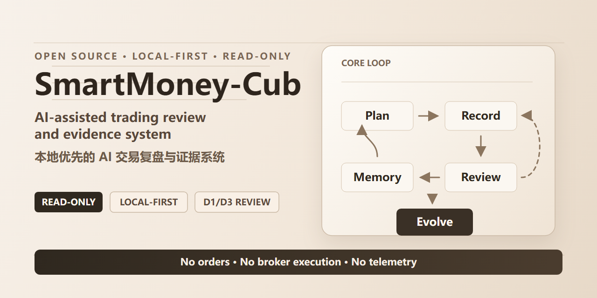

# smartmoney-cub

<div align="center">



## 游资复盘引擎 · 让每一次决策都变成系统的进化

*"散户靠感觉，高手靠系统。把你的感觉，变成可复盘、可验证、可进化的规则。"*

[](https://www.python.org/)
[](LICENSE)
[](tests/)
[](docs/safety.md)
[](docs/privacy.md)
[](docs/agent-loop.md)
[](docs/integrations.md)
[](docs/tradingagents-adapter.md)

只读 AI 复盘与规则进化 harness · 决策记录 · D1/D3 结果验证 · 本地 Markdown 记忆 · challenger -> champion 治理

[30 秒上手](#30-秒上手) · [5 秒体验闭环](#5-秒体验复盘闭环) · [核心理念](#核心理念系统--感觉) · [AI 助手接入](#给-ai-助手只读复盘协作) · [开源生态矩阵](#优秀开源项目集成矩阵) · [安全边界](#安全边界你的系统只属于你) · [CLI](#cli-commands)

`READ_ONLY_NO_ORDER_NO_CANCEL_NO_TRADE`

</div>

---

游资和散户最大的区别是什么？不是信息差，不是资金量，而是系统。

高手每一次决策都有计划、有证据、有复盘、有规则迭代。普通人最容易掉进的坑，是复盘时翻聊天记录、翻交易软件、翻截图，折腾半天还是说不清当时为什么买、错在什么地方、下一次该怎么改。

`smartmoney-cub` 是一个本地优先的 AI 复盘引擎。它帮你记录每一次决策的完整逻辑，追踪 D1/D3 的结果，把教训变成规则，把规则沉淀成系统。

它不是个股建议软件，不是自动交易系统，不是券商连接器，也不是财务建议系统。它是你的私人只读交易系统训练器。

## 30 秒上手

任何 agent 里丢一句话，让它按本仓库的安全合同跑 toy 离线闭环。公开仓库只使用 toy offline data。

| 你用的 agent | 直接丢这句 |
| --- | --- |
| Claude Code | `阅读 AGENTS.md 和 docs/harness-contract.md，运行 smcub loop --preset toy --agent-trigger "自进化"，只做只读复盘，不连接券商，不下单。` |
| Codex / OpenAI CLI | `在这个仓库里按 README 跑 smartmoney-cub toy loop：smcub loop --preset toy --agent-trigger "自进化"，然后阅读 loop_report.md 和 trace.jsonl。` |
| Cursor | `请按 docs/agent-loop.md 使用本项目，跑 toy loop 并总结复盘产物；所有规则更新只能保持 challenger 状态。` |
| Gemini CLI | `请阅读 docs/harness-contract.md，执行 toy offline loop，确认输出包含 READ_ONLY_NO_ORDER_NO_CANCEL_NO_TRADE。` |
| OpenCode / OpenClaw | `帮我用这个仓库做一次只读复盘演示：运行 smcub doctor，再运行 smcub loop --preset toy --agent-trigger "自进化"。` |
| CLI 直用 | `git clone https://github.com/myc0576/smartmoney-cub.git && cd smartmoney-cub && pip install -e ".[dev]" && smcub loop --preset toy --agent-trigger "自进化"` |

装好后最常用的安全命令：

```bash
smcub doctor
smcub privacy-audit
smcub loop --preset toy --agent-trigger "自进化"
smcub inspect-artifacts <run_dir>
```

本地私有 CSV 复盘可以使用自进化流程，但 champion 规则变更仍然必须人工确认：

```bash
smcub self-evolve --input-csv path/to/private_cases.csv --max-iterations 20 --time-budget-min 10 --horizon d1
smcub confirm-promotion state/self_evolve/<loop_id>/promotion_packet.json --decision promote --note "manual approval"
```

## 5 秒体验复盘闭环

真正有价值的复盘，不是看一眼盈亏就完事，而是把每一次判断拆成：计划是什么、证据是什么、结果是什么、下次怎么改。

一条命令跑完整个 toy 闭环：

```bash
git clone https://github.com/myc0576/smartmoney-cub.git
cd smartmoney-cub
pip install -e ".[dev]"
smcub loop --preset toy --agent-trigger "自进化"
```

运行后会在本地生成：

- `loop_report.md`
- `trace.jsonl`
- `case_record.json`
- `memory.md`
- `evolution_ledger.jsonl`

输出摘要会保持这个形状：

```json
{
  "status": "ok",
  "loop_name": "observe_candidate_plan_position_outcome_review_rule_update",
  "preset": "toy",
  "champion_mutated": false,
  "network_required": false,
  "telemetry": false,
  "safety": "READ_ONLY_NO_ORDER_NO_CANCEL_NO_TRADE"
}
```

## 核心理念：系统 > 感觉

单次判断会忘，系统会进化。

`smartmoney-cub` 把一次复盘拆成一条可审计链路：

```text
Plan -> Observe -> Record -> Outcome -> Evaluate -> Memory -> Rule Candidate
```

这条链路对应的是：

| 环节 | 作用 |
| --- | --- |
| Plan | 写清楚当时的计划、假设和风险条件 |
| Observe | 记录只读观察，不把观察变成买卖指令 |
| Record | 生成 manifest、decision、trace 等可审计产物 |
| Outcome | 等 D1/D3 结果出现后再评价，不偷看未来 |
| Evaluate | 检查决策质量、数据质量和安全合同 |
| Memory | 把复盘变成本地 Markdown 记忆 |
| Rule Candidate | 只提出 challenger 规则候选，不自动改 champion |

每一次错误都应该被拆解，每一条规则都应该被验证或淘汰。这个项目做的不是预测，而是帮你把主观判断训练成可复盘的系统。

## 给普通用户

你不需要券商 API，不需要量化背景，也不需要把私有资料放进公开仓库。你可以在本地整理这些只读输入：

- 交易计划文本。
- 交易日志 CSV。
- 同花顺或券商截图。
- 只读导出文件。
- 手写复盘笔记。
- toy offline 示例，用来先学习流程。

Harness 帮你结构化这些问题：

- 当时的 thesis 是什么？
- invalidation、time stop、give-up conditions 是否写清楚？
- 数据源、available time、data quality 是否可靠？
- D1/D3 之后结果如何？
- 这次失败是执行问题、证据问题，还是规则问题？
- 有没有值得进入 challenger 状态的规则候选？

## 给 AI 助手：只读复盘协作

AI 助手在这个仓库里只能扮演 reviewer、challenger、archivist、drift detector 或 systems assistant。它们帮助你复盘，不替你承担交易动作。

| 角色 | 可以做什么 | 不能做什么 |
| --- | --- | --- |
| Reviewer | 总结计划、证据、延迟结果和复盘评分 | 把复盘结论改写成买卖指令 |
| Challenger | 生成反方证据问题和缺失风险清单 | 只挑支持原判断的证据 |
| Archivist | 把本地产物整理成可携带 Markdown 记忆 | 把真实账户、截图或私有路径提交到公开仓库 |
| Drift Detector | 对比当前行为和历史规则 | 绕过指标与人工确认提升 champion |
| Systems Assistant | 拆解目标、风险、心理和结果 | 覆盖人的最终判断或执行交易 |

安全 agent workflow：

1. 读 `AGENTS.md` 和 [docs/harness-contract.md](docs/harness-contract.md)。
2. 运行 `smcub doctor`。
3. 运行 `smcub loop --preset toy --agent-trigger "自进化"`。
4. 打开 `loop_report.md` 和 `trace.jsonl`。
5. 提出复盘、安全、redaction、schema 或 workflow 改进。
6. 规则更新保持 challenger 状态。
7. champion 变更只通过显式人工确认路径发生。

详见 [docs/agent-loop.md](docs/agent-loop.md) 和 [docs/agent-integration.md](docs/agent-integration.md)。

## 优秀开源项目集成矩阵

这个 harness 会持续预留优秀开源项目的接入位。集成的目标不是制造更激进的交易信号，而是把外部工具的输出纳入只读复盘、证据整理和规则治理。

| 项目 / 类别 | 当前状态 | 可以怎样接入 harness | 安全边界 |
| --- | --- | --- | --- |
| [wbh604/UZI-Skill](https://github.com/wbh604/UZI-Skill) | 推荐搭配 / 生态接入位 | 作为外部分析报告或 agent skill 灵感来源，输出只能作为本地复盘材料进入 reviewer / challenger 流程 | 不声明内置运行时集成；不把分析结论变成买卖指令 |
| [TauricResearch/TradingAgents](https://github.com/TauricResearch/TradingAgents) | optional documented adapter / 用户自选外部引擎 | 用户本地运行 TradingAgents 生成多智能体分析/候选报告，或显式开启 optional local bridge 生成只读 review packet；该 packet 进入 reviewer / challenger / D1-D3 outcome review / rule candidate 流程 | 用户自行配置 LLM/API key；harness 不保存、不收集、不上传 key；不连接券商；不下单；不把 TradingAgents 输出直接当交易指令 |
| 数据源适配项目 | 预留 | 只读导出、toy fixture、公开样例 schema | 不接 broker execution，不写账户，不下单 |
| 报告生成项目 | 预留 | 把 `loop_report.md`、case record、ledger 转成更好的本地阅读材料 | 不上传私有复盘，不发布真实持仓 |
| Agent skill 项目 | 预留 | 增强 reviewer、challenger、archivist、drift detector 的协作体验 | 不允许越权到交易执行 |
| 评估 / 回测项目 | 预留 | 帮助评估规则候选和样本质量 | 不跳过 D1/D3 provenance 与 future-leakage 检查 |
| 知识记忆项目 | 预留 | 管理本地 Markdown memory、case bank、evolution ledger | 不上传私有交易逻辑 |

接入规则见 [docs/integrations.md](docs/integrations.md)。

## 插件系统：按需接入重量级开源项目

核心保持零重依赖（不捆绑 PyTorch / LangGraph / Qlib / AKShare）。重量级开源项目通过插件系统按需安装到 `~/.smartmoney-cub/plugins/<id>/.venv` 独立虚拟环境，以子进程 + JSON stdin/stdout 协议运行，与核心完全隔离。

| 插件 | 能力 | 输出类型 | 集成级别 | 许可证 |
| --- | --- | --- | --- | --- |
| `akshare` | A股/指数/板块 OHLCV 统一行情包 | `market_data` | runtime_integrated | MIT |
| `tradingagents` | 多智能体 LLM 研究叙事 | `llm_interpretation` | runtime_integrated | Apache-2.0 |
| `qlib` | 预训练工作流的横截面打分 | `uncalibrated_score` | runtime_integrated | MIT |
| `chronos2` | 变换序列上的零样本分位数预测 | `numeric_model_forecast` | runtime_integrated | Apache-2.0 |
| `timesfm` | 时序基础模型 | — | catalog_available | Apache-2.0 |
| `neuralforecast` | 经典+神经网络预测库 | — | catalog_available | Apache-2.0 |
| `finrobot` | 多智能体金融分析平台 | — | adapter_planned | Apache-2.0 |

```bash
# 发现与安装（显式同意门控）
smcub plugin list
smcub plugin install akshare --yes --allow-network --ack-third-party
smcub plugin install chronos2 --yes --allow-network --ack-third-party --ack-model-download
smcub plugin doctor

# 多插件复盘分析：各插件结果独立保留，不合成、不平均
smcub analyze --target 600519.SS --target-type stock --horizon d5   --data-provider akshare --plugins tradingagents,chronos2   --allow-network --ack-third-party
```

聚合报告只做证据整理：逐插件保留原始 evidence packet，标注一致/冲突/缺失信息，**永远不会**输出未经校准的"上涨概率"。LLM 叙事、模型打分、数值预测是三种不同证据，不会混成一个数字。卸载插件不会删除用户生成的分析结果。

免责声明：插件运行第三方代码，安装前请自行审阅上游项目；Chronos/TimesFM 等通用时序模型并非专为金融市场训练，输出仅为弱证据；一切输出都是只读复盘材料，不构成投资建议。详见 [docs/plugins.md](docs/plugins.md)、[docs/plugin-security.md](docs/plugin-security.md) 与 [THIRD_PARTY_PLUGINS.md](THIRD_PARTY_PLUGINS.md)。

## 可选接入 TradingAgents

TradingAgents 适合已经会配置 LLM provider、并希望把外部多智能体金融分析能力接入本地复盘系统的用户。默认 toy loop 不需要 TradingAgents，也不需要任何 LLM/API key；`smartmoney-cub` 本身不托管、不读取明文、不提交、不上传 TradingAgents 的 key。

推荐两种模式：

1. `report-only mode`：用户独立运行 TradingAgents，把本地报告导入 harness，生成只读 review packet。
2. `optional local bridge mode`：用户已经在本地安装并配置 TradingAgents 后，显式传入 `--allow-network` 和 `--ack-external-llm`，由 adapter 包装外部分析结果为 review packet。

```bash
# report-only：用户先在 TradingAgents 中生成报告，然后导入本 harness
smcub tradingagents-ingest \
  --report path/to/tradingagents_report.md \
  --ticker 600519.SS \
  --analysis-date 2026-07-06 \
  --output artifacts/tradingagents_review_packet.json

# optional local bridge：仅当用户本地已经安装并配置 TradingAgents 后使用
smcub tradingagents-doctor
smcub tradingagents-run \
  --ticker 600519.SS \
  --analysis-date 2026-07-06 \
  --output artifacts/tradingagents_review_packet.json \
  --allow-network \
  --ack-external-llm
```

TradingAgents 的输出只会进入 reviewer / challenger / evidence / case-review 流程。它不能成为买入、卖出、下单、撤单、自动执行或账户操作的指令；任何 rule candidate 进入 champion 仍然必须由人显式确认。

## 安全边界：你的系统，只属于你

交易逻辑和复盘记忆是私有资产。`smartmoney-cub` 的设计原则是：你的交易系统只在你本地进化。

每个 manifest、decision、outcome、evaluation、registry、doctor output 和 loop output 都必须携带：

```text
READ_ONLY_NO_ORDER_NO_CANCEL_NO_TRADE
```

项目默认：

- Local-first。
- Offline by default。
- No telemetry。
- No upload。
- No trading execution。
- No broker automation。
- CLI 输出前先 redaction。
- 公开仓库只使用 toy examples。

它明确不做：

- 不下单。
- 不撤单。
- 不修改账户。
- 不自动化券商。
- 不连接真实交易执行。
- 发布真实交易记录、真实 watchlist、账户数据、私有策略 prompt、私有路径、credentials 或 cookies。

运行：

```bash
smcub privacy-audit
smcub doctor
```

## Privacy

This project does not collect, upload, sell, or learn your trading logic. By default it has no server, no telemetry, no remote database, and no real account connection.

Your private trading logic should remain in local artifacts on your machine. It must not be copied into the public repository. Public examples must stay toy-only.

See [docs/privacy.md](docs/privacy.md) and [docs/public-vs-private-quantkb.md](docs/public-vs-private-quantkb.md).

## CLI Commands

```bash
smcub loop --preset toy --agent-trigger "自进化"
smcub privacy-audit
smcub self-evolve --input-csv path/to/private_cases.csv --max-iterations 20 --time-budget-min 10 --horizon d1
smcub confirm-promotion state/self_evolve/<loop_id>/promotion_packet.json --decision promote --note "manual approval"
smcub inspect-artifacts <run_dir>
smcub collect-case <run_dir>
smcub append-ledger --event EVENT --payload-json FILE
smcub save-memory --case-record FILE
smcub tradingagents-doctor
smcub tradingagents-ingest --report path/to/tradingagents_report.md --ticker 600519.SS --analysis-date 2026-07-06
smcub tradingagents-run --ticker 600519.SS --analysis-date 2026-07-06 --allow-network --ack-external-llm
smcub plugin list
smcub plugin info tradingagents
smcub plugin install akshare --yes --allow-network --ack-third-party
smcub plugin doctor
smcub plugin configure qlib --key data_dir --value /path/to/qlib_data
smcub plugin uninstall chronos2 --yes
smcub analyze --target 600519.SS --target-type stock --horizon d5 --data-provider akshare --plugins tradingagents,chronos2 --allow-network --ack-third-party
smcub doctor
smcub validate-manifest examples/sample_run/run_manifest.json
```

## Development Checks

```bash
pip install -e ".[dev]"
pytest -q
python -m smartmoney_cub.cli doctor
python -m smartmoney_cub.cli --help
```

## Public Boundary

The public repo can include schemas, loop runtime, toy examples, redaction, case bank, local Markdown memory format, evolution ledger, challenger/champion governance, integration guidance, and agent runbooks.

The public repo must not include real trades, real watchlists, account data, private QMT paths, private strategy prompts, key stock-picking logic, secret scoring weights, credentials, cookies, or local private workspace paths.

`READ_ONLY_NO_ORDER_NO_CANCEL_NO_TRADE` remains the public boundary and runtime safety declaration.

## License

MIT. See [LICENSE](LICENSE).
