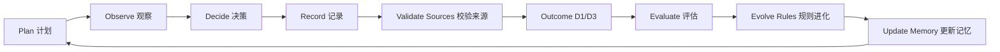

# smartmoney-cub-harness

[](https://www.python.org/)
[](LICENSE)
[](tests/)
[](docs/safety.md)
[](docs/safety.md)
[](docs/harness-contract.md)
[](docs/agent-integration.md)

A read-only AI trading companion harness for decision logging, outcome review, and rule evolution.

**聪明资金幼年体 / 游资幼年体：陪你复盘，不替你下单。**

**Not a stock-picking bot. A read-only harness where human traders and AI agents evolve together.**

## 安全声明

本项目仅用于研究、复盘、交易日志和教育型工作流设计。不构成证券投资建议，不提供个股推荐，不承诺收益，不是交易执行系统，不下单、不撤单、不修改账户。

所有 manifest、decision、outcome、evaluation、registry 和 doctor 输出都必须携带：

```text
READ_ONLY_NO_ORDER_NO_CANCEL_NO_TRADE
```

## 为什么会有这个项目

很多交易者都听过小资金做大的神话。可真正困难的不是听故事，而是把故事背后的判断、纪律、失误、周期感和人性训练，拆成每天可以复盘的证据链。

`smartmoney-cub-harness` 想做的不是一个荐股机器人，而是一只还在长大的“聪明资金幼年体”。它只读市场，不替你下单；它记录你的计划、观察、决策、失效位、放弃条件、数据来源和 D1/D3 结果；它在结果出来以后和你一起复盘：这一次是模式有效，还是运气？是规则进化，还是情绪失控？

在 AI 时代，交易者不再只能一个人摸索。大模型可以成为你的陪练、复盘员、质询者、规则档案管理员和漂移检测器。但最终的判断，必须由人负责。真正的模式，要从人、市场反馈和历史决策记忆之间长出来。

这不是复制别人的龙头战法，而是找到你自己的可验证模式。不是迷信某一句心法，而是让每一句心法接受样本、结果和风险边界的审查。小资金做大的神话，真正需要的是纪律、反馈和复利式的认知迭代。

## 它是什么

- 只读交易陪练 harness。
- 决策日志工具。
- 证据来源校验器。
- 反未来函数检查器。
- D1/D3 outcome reviewer。
- 规则进化闭环。
- Agent 集成脚手架。
- 个人交易模式实验室。

## 它不是什么

- 不是荐股软件。
- 不是信号售卖器。
- 不是券商或交易接口。
- 不是自动交易机器人。
- 不构成证券投资建议。
- 不承诺收益。
- 不替代人的最终判断。

## 核心循环



- **Plan**：写下交易前提。
- **Observe**：只读观察市场。
- **Decide**：记录决策，不自动交易。
- **Record**：保存证据链。
- **Validate**：检查数据时间和质量，防未来函数。
- **Outcome**：D1/D3 之后再评价。
- **Evolve**：通过 challenger -> champion 规则晋级。
- **Memory**：形成可迁移的 Markdown 交易记忆。

## Human × Agent Co-Evolution

AI 不是神谕。在这个 harness 里，Agent 是陪练：它帮你提出反方问题，帮你复盘延迟结果，帮你归档证据，帮你发现规则漂移，也帮你从交易日志里提炼模式。

人负责最终判断。

> The edge is not inside the model. The edge emerges from the feedback loop between the trader, the market, and the memory of past decisions.

优势不在模型里，也不在某句心法里。优势长在交易者、市场反馈和历史决策记忆之间的闭环里。

## Why I built it this way

这个架构背后只放了两个思想底座：易经和钱学森的系统工程。不是因为它们神秘，而是因为它们足够朴素。

易经给的是周期、时位、变易、不易、进退和节制。交易不是预测一个点，而是在不同市场状态下识别自己该不该出手。

钱学森的系统工程给的是目标分解、反馈闭环、人机协同、定性到定量、从局部到整体的综合集成。交易系统不是一个指标，也不是一个 prompt，而是一套持续校验、持续修正、持续进化的复杂系统。

`smartmoney-cub-harness` 把这两者落到工程里：每一次判断都要有来源，每一次非静默观察都要有失效位，每一次结果都要回到规则，每一次规则更新都要经过样本和审查。

这里不是“易经预测涨跌”，也不是“卦象选股”，更不是神秘周期模型。它只把周期、时位、状态机、反馈控制和系统工程变成可审计的工作流。

## 快速开始

```bash
git clone https://github.com/<OWNER>/smartmoney-cub-harness.git
cd smartmoney-cub-harness
python -m pip install -e .
smcub doctor
smcub capture-run --mode after-close --sandbox --decision-time "2026-06-01T15:30:00+08:00" --command "python examples/toy_strategy/leader_pullback_demo.py"
smcub build-outcome tmp/sandbox/20260601/20260601_153000-after-close --horizon d1 --price-source examples/toy_strategy/sample_prices.json
smcub evaluate-run tmp/sandbox/20260601/20260601_153000-after-close --horizon d1
```

上面的固定 decision time 会在干净 checkout 中生成示例里的 sandbox 路径。CLI JSON 会遮盖本机绝对路径；如果要重复运行同一组命令，请换一个 decision time。

## Demo output

Toy decision：

```json
{
  "schema": "smartmoney_cub_decision.v1",
  "action_label": "ALERT",
  "symbol": "TOY.CUB",
  "invalidation_price": 9.4,
  "time_stop": "D1/D3 review",
  "give_up_conditions": [
    "observation thesis is no longer supported by recorded evidence",
    "price below invalidation_price 9.4000"
  ],
  "data_source": "toy_strategy",
  "available_at": "2026-06-01T15:30:00+08:00",
  "data_quality_flag": "ok",
  "safety": "READ_ONLY_NO_ORDER_NO_CANCEL_NO_TRADE"
}
```

Toy evaluation：

```json
{
  "grade": "useful_alert",
  "failure_tags": [],
  "scores": {
    "valid_contract": 1,
    "false_alert": 0,
    "missed_opportunity": 0,
    "risk_contract_violation": 0
  },
  "safety": "READ_ONLY_NO_ORDER_NO_CANCEL_NO_TRADE"
}
```

## GitHub 元信息建议

Repository description:

```text
Read-only AI trading companion harness for decision logging, D1/D3 review, and rule evolution.
```

Topics:

```text
trading-journal
trading-harness
ai-agent
human-in-the-loop
quant-research
decision-logging
rule-evolution
backtesting
market-research
read-only
no-financial-advice
```

## 开发检查

```bash
python -m pip install -e ".[dev]"
pytest -q
python -m smartmoney_cub_harness.cli doctor
python -m smartmoney_cub_harness.cli --help
```

## Contributing

欢迎贡献，但必须保持只读安全合约。示例只能使用离线 toy data。不要添加真实交易执行、券商自动化、账户修改、私人 watchlist、凭证、cookie、本机绝对路径或个人交易记录。

## License

MIT. See [LICENSE](LICENSE).

## 安全声明

本项目仅用于研究、复盘、交易日志和教育型工作流设计。不构成证券投资建议，不提供个股推荐，不承诺收益，不是交易执行系统，不下单、不撤单、不修改账户。
