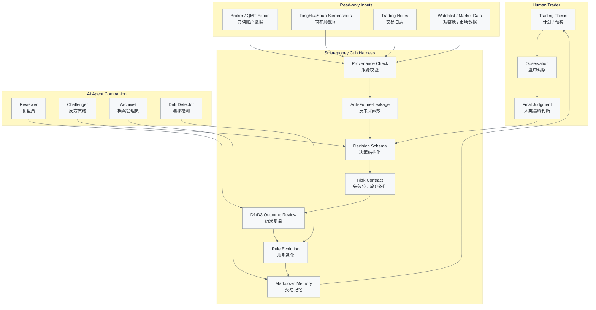

# smartmoney-cub-harness：聪明资金幼年体

[](https://www.python.org/)
[](LICENSE)
[](tests/)
[](docs/safety.md)
[](docs/safety.md)
[](docs/harness-contract.md)
[](docs/agent-integration.md)

不是荐股机器人，而是陪主观交易者复盘、质询、进化的 AI 决策 Harness。

**聪明资金幼年体 / 游资幼年体：陪你复盘，不替你下单。**  
**把“小资金做大的神话”，拆成每天可记录、可验证、可进化的交易系统。**

## Safety Disclaimer

本项目仅用于研究、交易日志、复盘和教育型工作流设计。不构成证券投资建议，不提供个股推荐，不预测具体证券价格走势，不承诺收益，不是交易执行系统。任何账户、截图或交易记录输入都只用于用户本地的复盘与结构化分析。

所有 manifest、decision、outcome、evaluation、registry 和 doctor 输出都必须携带：

```text
READ_ONLY_NO_ORDER_NO_CANCEL_NO_TRADE
```

## 为什么会有这个项目

很多人都听过 A 股江湖里“小资金做大”的神话。

有人记住了龙头，有人记住了情绪，有人记住了分歧转一致，有人记住了“高手买入龙头，超级高手卖出龙头”。但真正难的不是背下这些语录，而是在自己的账户里，把每一次冲动、犹豫、误判、错过、格局和撤退，变成可以复盘的证据链。

`smartmoney-cub-harness` 想做的不是一个告诉你明天买什么的机器人。它是一只还在长大的“聪明资金幼年体”：它只读你的账户导出、截图、日志或 toy data，只记录你的计划和证据，只在结果出来之后和你一起复盘。

它问你的不是“下一只牛股是什么”，而是：

- 你当时为什么出手？
- 你的失效位在哪里？
- 这是模式，还是运气？
- 是周期给了机会，还是情绪让你上头？
- 这条规则经过 D1/D3 检验后，应该晋级、降级，还是删除？

在 AI 时代，高手指导不再只能靠运气遇到。大模型可以成为你的陪练、质询者、复盘员、规则档案管理员和系统工程助手。但真正属于你的模式，必须由你和 AI 在反馈闭环里一起长出来。

这里会使用龙头、情绪、周期、分歧、一致、退潮、修复等 A 股主观交易语境，但它们只是复盘标签，不代表收益承诺、具体证券观点或投资建议。

## 它是什么

- 主观交易决策 harness。
- 只读账户 / 截图复盘陪练。
- 带证据来源与失效位纪律的交易日志。
- D1/D3 outcome review engine。
- 规则进化闭环。
- Agent-ready review framework。
- 个人模式发现系统。
- 连接人类经验和机器审计的半量化桥梁。

## 它不是什么

- 不是量化 alpha 工厂。
- 不是单一交易策略。
- 不是荐股机器人。
- 不是信号售卖系统。
- 不是券商接口或执行机器人。
- 不是自动交易系统。
- 不构成证券投资建议。
- 不承诺小资金一定做大。

## Account & Screenshot Input

`smartmoney-cub-harness` 可以接收不同层级的输入：

- 只读 broker/account export。
- 本地配置的只读 QMT 或 adapter integration。
- 交易日志 CSV。
- Watchlist 文件。
- 同花顺 / 券商持仓、成交、盘后复盘截图。
- 手写交易计划和复盘文本。

所有输入都只用于复盘和日志生成；默认不接真实交易执行接口；不会下单、撤单或修改账户。截图输入尤其适合普通用户，因为它比 API 更安全、门槛更低、权限面更小。

哪怕你没有 API，也可以把同花顺持仓截图、券商成交截图、交易计划文本丢给它，它依然可以作为 AI 复盘陪练，帮你整理当时的计划、风险、失效位和后续结果。

## 核心循环图



## Where the 易经 Thinking Lives

这里不写玄学，不写卦象预测，不写算命，也不写“易经判断涨跌”。易经在这个项目里的位置，是把周期、时位、变易、不易、进退、节制和反方证据工程化。

| 易经思想 | Harness 模块 | 工程化含义 |
| ---- | ---------- | ----- |
| Market Regime / Sentiment Cycle | `decision.json`、outcome 标签、Markdown memory | 记录市场处在初生、新题材试探；生长、主线确认；亢龙、一致加速；衰退、分歧放大；潜藏、退潮/空仓/等待中的哪个阶段。 |
| Timing & Position | `decision_time`、`available_at`、D1/D3 horizon | 不只问“能不能做”，还问“现在处在周期的哪个位置”。同样的模式在不同情绪位置，风险收益完全不同。 |
| Change vs Invariance | `manifest.py`、`evaluator.py`、`registry.py` | 变的是题材、龙头、情绪、市场偏好；不变的是风险边界、复盘、失效位、纪律和样本验证。 |
| Advance / Retreat / Restraint | `WATCH`、`AVOID`、`EMPTY_POSITION`、risk contract | 市场状态不支持时，系统应记录观察、回避或空仓。空仓也是决策，退潮期的目标是保留下一次进攻资格。 |
| Opposing Evidence | Agent challenger、failure tags | 每个 bullish thesis 都要生成 opposing thesis，Agent 必须主动提出反方问题，防止只收集支持自己想法的证据。 |

## Where Systems Engineering Lives

钱学森系统工程在这里不是口号，而是模块化工作流。

| 系统工程思想 | Harness 模块 | 工程化含义 |
| ------ | ---------- | ----- |
| Goal Tree | 目标记录、复盘笔记、rule registry | 区分年度目标、月度目标、单笔交易目标、复盘目标；不以一次交易输赢定义系统。 |
| Decomposition & Integration | `manifest`、`decision`、`outcome`、`evaluation` | 把市场状态、主线题材、个股辨识度、仓位、风险、心理状态、交易后结果拆开，再综合成 `decision.json` 和 `evaluation.json`。 |
| Feedback Loop | Plan -> Observe -> Decide -> Record -> Outcome -> Evaluate -> Evolve | 先记录，再等结果，再复盘，再进化，避免在情绪最热时修改规则。 |
| Human-Machine Collaboration | `docs/agent-integration.md` | 人负责最终判断；AI 负责质询、整理、复盘、归档、发现漂移。Agent 不是神谕，是陪练。 |
| Qualitative-to-Quantitative Review | D1/D3 outcome、challenger -> champion registry | 主观判断先被结构化，再被 D1/D3 outcome 评价，再进入规则晋级流程。 |

## Not Quant Trading. Not Pure Discretion. A Semi-Quant AI Decision Harness.

传统量化交易系统通常先定义策略，用历史数据回测，追求可重复信号，甚至可能自动执行，策略形态相对固定。

本项目从主观交易经验出发，记录人做决策时的证据链，用 AI 质询和结构化，用 D1/D3 结果检验，让规则和交易者一起进化。它不是一个固定策略，而是帮助策略成熟的 harness。

| Dimension | Traditional Quant System | smartmoney-cub-harness |
| --------- | ------------------------ | ---------------------- |
| Starting point | 策略定义与历史数据 | 人的判断、预案、上下文和证据链 |
| Core question | 信号是否可重复 | 当时为什么出手，后续证据是否支持 |
| Execution | 可能自动执行 | 永不执行，只读复盘 |
| Strategy shape | 相对固定 | 通过 D1/D3 和规则治理持续进化 |
| AI role | 信号生成或优化 | 质询者、复盘员、档案管理员、漂移检测器 |
| Output | 信号、组合、回测指标 | manifest、decision、outcome、evaluation、memory、rule candidate |
| Human role | 可能被弱化 | 被保留，并变得可记录、可审查、可迭代 |

它不是策略本身，而是策略成长的容器。它不是替代交易者，而是训练交易者。它不是把人拿掉，而是把人的经验变得可记录、可审查、可迭代。

## Human × Agent Co-Evolution

AI 不是神谕。在这个 harness 里，Agent 是陪练：它帮你提出反方问题，帮你复盘延迟结果，帮你归档证据，帮你发现规则漂移，也帮你从交易日志里提炼模式。

人负责最终判断。

> The edge is not inside the model. The edge emerges from the feedback loop between the trader, the market, and the memory of past decisions.

优势不在模型里，也不在某句心法里。优势长在交易者、市场反馈和历史决策记忆之间的闭环里。

## Quick Start

```bash
git clone https://github.com/myc0576/smartmoney-cub-harness.git
cd smartmoney-cub-harness
python -m pip install -e .
smcub doctor
smcub capture-run --mode after-close --sandbox --decision-time "2026-06-01T15:30:00+08:00" --command "python examples/toy_strategy/leader_pullback_demo.py"
smcub build-outcome tmp/sandbox/20260601/20260601_153000-after-close --horizon d1 --price-source examples/toy_strategy/sample_prices.json
smcub evaluate-run tmp/sandbox/20260601/20260601_153000-after-close --horizon d1
```

上面的固定 decision time 会在干净 checkout 中生成示例里的 sandbox 路径。CLI JSON 会遮盖本机绝对路径；如果要重复运行同一组命令，请换一个 decision time。

## Demo output

Toy decision：

```json
{
  "schema": "smartmoney_cub_decision.v1",
  "action_label": "ALERT",
  "symbol": "TOY.CUB",
  "invalidation_price": 9.4,
  "time_stop": "D1/D3 review",
  "give_up_conditions": [
    "observation thesis is no longer supported by recorded evidence",
    "price below invalidation_price 9.4000"
  ],
  "data_source": "toy_strategy",
  "available_at": "2026-06-01T15:30:00+08:00",
  "data_quality_flag": "ok",
  "safety": "READ_ONLY_NO_ORDER_NO_CANCEL_NO_TRADE"
}
```

Toy evaluation：

```json
{
  "grade": "useful_alert",
  "failure_tags": [],
  "scores": {
    "valid_contract": 1,
    "false_alert": 0,
    "missed_opportunity": 0,
    "risk_contract_violation": 0
  },
  "safety": "READ_ONLY_NO_ORDER_NO_CANCEL_NO_TRADE"
}
```

## 开发检查

```bash
python -m pip install -e ".[dev]"
pytest -q
python -m smartmoney_cub_harness.cli doctor
python -m smartmoney_cub_harness.cli --help
```

## Contributing

欢迎贡献，但必须保持只读安全合约。示例只能使用离线 toy data。不要添加真实交易执行、券商自动化、下单、撤单、账户修改、私人 watchlist、凭证、cookie、本机绝对路径或个人交易记录。

## License

MIT. See [LICENSE](LICENSE).

## Safety Disclaimer

本项目仅用于研究、交易日志、复盘和教育型工作流设计。不构成证券投资建议，不提供个股推荐，不预测具体证券价格走势，不承诺收益，不是交易执行系统。任何账户、截图或交易记录输入都只用于用户本地的复盘与结构化分析。
