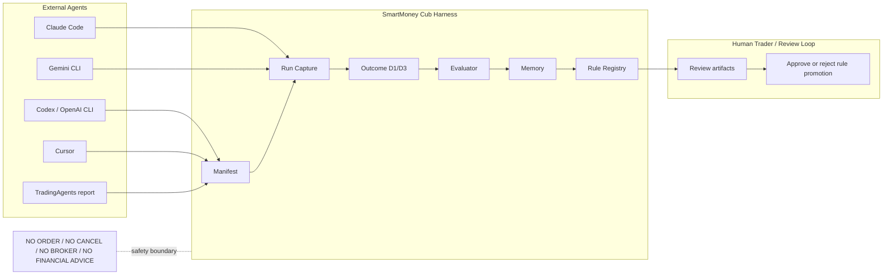

# smartmoney-cub-harness

<div align="center">


## 游资复盘引擎 · 让每一次决策都变成系统的进化

*"散户靠感觉，高手靠系统。把你的感觉，变成可复盘、可验证、可进化的规则。"*

[](https://www.python.org/)
[](LICENSE)
[](tests/)
[](docs/safety.md)
[](docs/privacy.md)
[](docs/external-review-brain.md)
[](docs/agent-integration.md)
[](docs/external-review-brain.md)
[](docs/safety.md)
[](docs/agent-loop.md)
[](docs/integrations.md)

无需内置 LLM API 的只读交易复盘大脑：让 Codex、Claude Code、Cursor、Gemini 等外部 Agent 把交易观点转化为可审计、可复盘、可进化的本地规则系统。

TradingAgents 产生交易研究观点，SmartMoney Cub 负责审计、复盘和进化这些观点。

[30 秒上手](#30-秒上手) · [5 秒体验闭环](#5-秒体验复盘闭环) · [外置复盘大脑](#不是交易-agent而是-agent-的外置复盘大脑) · [核心理念](#核心理念系统--感觉) · [AI 助手接入](#给-ai-助手只读复盘协作) · [Agent 交互模型](#agent-interaction-model) · [与 TradingAgents 的差异](#与-tradingagents-的差异) · [开源生态矩阵](#优秀开源项目集成矩阵) · [安全边界](#安全边界你的系统只属于你) · [CLI](#cli-commands)

`READ_ONLY_NO_ORDER_NO_CANCEL_NO_TRADE`

</div>

---

游资和散户最大的区别是什么？不是信息差，不是资金量，而是系统。

高手每一次决策都有计划、有证据、有复盘、有规则迭代。普通人最容易掉进的坑，是复盘时翻聊天记录、翻交易软件、翻截图，折腾半天还是说不清当时为什么买、错在什么地方、下一次该怎么改。

`smartmoney-cub-harness` 不是另一个内置 LLM API 的 trading agent framework。它是一个 local-first、read-only、agent-agnostic 的外置复盘大脑。

这个 harness 本身不内置、不要求 OpenAI、Anthropic、Gemini 或任何 LLM provider 的 API key。Codex、Claude Code、Cursor、Gemini CLI、OpenCode、OpenClaw 等外部 agent 自带推理环境，读取本地合同文件，运行 `smcub`，把交易假设、研究观点、复盘文本或外部报告转化成可审计的本地证据链。

它不是个股建议软件，不是自动交易系统，不是券商连接器，也不是财务建议系统。外部 agent 负责“思考和写报告”，SmartMoney Cub 负责“留痕、审计、复盘和规则治理”。

## 30 秒上手

任何 agent 里丢一句话，让它按本仓库的安全合同跑 toy 离线闭环。公开仓库只使用 toy offline data。

| 你用的 agent | 直接丢这句 |
| --- | --- |
| Claude Code | `阅读 AGENTS.md 和 docs/harness-contract.md，运行 smcub loop --preset toy --agent-trigger "自进化"，只做只读复盘，不连接券商，不下单。` |
| Codex / OpenAI CLI | `在这个仓库里按 README 跑 smartmoney-cub-harness toy loop：smcub loop --preset toy --agent-trigger "自进化"，然后阅读 loop_report.md 和 trace.jsonl。` |
| Cursor | `请按 docs/agent-loop.md 使用本项目，跑 toy loop 并总结复盘产物；所有规则更新只能保持 challenger 状态。` |
| Gemini CLI | `请阅读 docs/harness-contract.md，执行 toy offline loop，确认输出包含 READ_ONLY_NO_ORDER_NO_CANCEL_NO_TRADE。` |
| OpenCode / OpenClaw | `帮我用这个仓库做一次只读复盘演示：运行 smcub doctor，再运行 smcub loop --preset toy --agent-trigger "自进化"。` |
| CLI 直用 | `git clone https://github.com/myc0576/smartmoney-cub-harness.git && cd smartmoney-cub-harness && pip install -e ".[dev]" && smcub loop --preset toy --agent-trigger "自进化"` |

装好后最常用的安全命令：

```bash
smcub doctor
smcub privacy-audit
smcub loop --preset toy --agent-trigger "自进化"
smcub inspect-artifacts <run_dir>
```

本地私有 CSV 复盘可以使用自进化流程，但 champion 规则变更仍然必须人工确认：

```bash
smcub self-evolve --input-csv path/to/private_cases.csv --max-iterations 20 --time-budget-min 10 --horizon d1
smcub confirm-promotion state/self_evolve/<loop_id>/promotion_packet.json --decision promote --note "manual approval"
```

## 5 秒体验复盘闭环

真正有价值的复盘，不是看一眼盈亏就完事，而是把每一次判断拆成：计划是什么、证据是什么、结果是什么、下次怎么改。

一条命令跑完整个 toy 闭环：

```bash
git clone https://github.com/myc0576/smartmoney-cub-harness.git
cd smartmoney-cub-harness
pip install -e ".[dev]"
smcub loop --preset toy --agent-trigger "自进化"
```

运行后会在本地生成：

- `loop_report.md`
- `trace.jsonl`
- `case_record.json`
- `memory.md`
- `evolution_ledger.jsonl`

输出摘要会保持这个形状：

```json
{
  "status": "ok",
  "loop_name": "observe_candidate_plan_position_outcome_review_rule_update",
  "preset": "toy",
  "champion_mutated": false,
  "network_required": false,
  "telemetry": false,
  "safety": "READ_ONLY_NO_ORDER_NO_CANCEL_NO_TRADE"
}
```

## 不是交易 Agent，而是 Agent 的外置复盘大脑

TradingAgents 更像前向研究团队：它可以组织分析师、研究员、交易员和风险角色，生成市场观点或模拟交易决策。SmartMoney Cub 位于这些观点之后的后处理与治理层。

外部 agent 负责思考和写报告。它可以写交易 thesis、总结研究报告、挑战假设，也可以导入 TradingAgents report。SmartMoney Cub 负责记录观点、校验证据、追踪 D1/D3 结果、沉淀本地 memory、提出 challenger rule。它永不下单、永不撤单、永不连接券商执行、永不上传私有策略，也不会自动修改 champion 规则。

因此它适合作为 Codex、Claude Code、Cursor、Gemini CLI、OpenCode 等工具的外置大脑：agent 不需要通过本项目内置 API 调模型，只需要读 `AGENTS.md`、`CLAUDE.md`、`docs/harness-contract.md` 等本地文件，并运行 `smcub` CLI。

### SmartMoney Cub as an External Review Brain


```mermaid
flowchart LR
    subgraph A["External Agents"]
        codex["Codex / OpenAI CLI"]
        claude["Claude Code"]
        cursor["Cursor"]
        gemini["Gemini CLI"]
        report["TradingAgents report"]
    end

    subgraph H["SmartMoney Cub Harness"]
        manifest["Manifest"]
        capture["Run Capture"]
        outcome["Outcome D1/D3"]
        eval["Evaluator"]
        memory["Memory"]
        registry["Rule Registry"]
    end

    subgraph R["Human Trader / Review Loop"]
        review["Review artifacts"]
        approve["Approve or reject rule promotion"]
    end

    codex --> manifest
    claude --> capture
    cursor --> manifest
    gemini --> capture
    report --> manifest
    manifest --> capture --> outcome --> eval --> memory --> registry --> review --> approve

    boundary["NO ORDER / NO CANCEL / NO BROKER / NO FINANCIAL ADVICE"]
    boundary -. safety boundary .- H
```

## 核心理念：系统 > 感觉

单次判断会忘，系统会进化。

`smartmoney-cub-harness` 把一次复盘拆成一条可审计链路：

```text
Plan -> Observe -> Record -> Outcome -> Evaluate -> Memory -> Rule Candidate
```

这条链路对应的是：

| 环节 | 作用 |
| --- | --- |
| Plan | 写清楚当时的计划、假设和风险条件 |
| Observe | 记录只读观察，不把观察变成买卖指令 |
| Record | 生成 manifest、decision、trace 等可审计产物 |
| Outcome | 等 D1/D3 结果出现后再评价，不偷看未来 |
| Evaluate | 检查决策质量、数据质量和安全合同 |
| Memory | 把复盘变成本地 Markdown 记忆 |
| Rule Candidate | 只提出 challenger 规则候选，不自动改 champion |

每一次错误都应该被拆解，每一条规则都应该被验证或淘汰。这个项目做的不是预测，而是帮你把主观判断训练成可复盘的系统。

## 给普通用户

你不需要券商 API，不需要量化背景，也不需要把私有资料放进公开仓库。你可以在本地整理这些只读输入：

- 交易计划文本。
- 交易日志 CSV。
- 同花顺或券商截图。
- 只读导出文件。
- 手写复盘笔记。
- toy offline 示例，用来先学习流程。

Harness 帮你结构化这些问题：

- 当时的 thesis 是什么？
- invalidation、time stop、give-up conditions 是否写清楚？
- 数据源、available time、data quality 是否可靠？
- D1/D3 之后结果如何？
- 这次失败是执行问题、证据问题，还是规则问题？
- 有没有值得进入 challenger 状态的规则候选？

## 给 AI 助手：只读复盘协作

AI 助手在这个仓库里只能扮演 reviewer、challenger、archivist、drift detector 或 systems assistant。它们帮助你复盘，不替你承担交易动作。

| 角色 | 可以做什么 | 不能做什么 |
| --- | --- | --- |
| Reviewer | 总结计划、证据、延迟结果和复盘评分 | 把复盘结论改写成买卖指令 |
| Challenger | 生成反方证据问题和缺失风险清单 | 只挑支持原判断的证据 |
| Archivist | 把本地产物整理成可携带 Markdown 记忆 | 把真实账户、截图或私有路径提交到公开仓库 |
| Drift Detector | 对比当前行为和历史规则 | 绕过指标与人工确认提升 champion |
| Systems Assistant | 拆解目标、风险、心理和结果 | 覆盖人的最终判断或执行交易 |

安全 agent workflow：

1. 读 `AGENTS.md` 和 [docs/harness-contract.md](docs/harness-contract.md)。
2. 运行 `smcub doctor`。
3. 运行 `smcub loop --preset toy --agent-trigger "自进化"`。
4. 打开 `loop_report.md` 和 `trace.jsonl`。
5. 提出复盘、安全、redaction、schema 或 workflow 改进。
6. 规则更新保持 challenger 状态。
7. champion 变更只通过显式人工确认路径发生。

详见 [docs/agent-loop.md](docs/agent-loop.md) 和 [docs/agent-integration.md](docs/agent-integration.md)。

## Agent Interaction Model


```text
External Agent -> read contract -> run smcub CLI -> inspect artifacts -> write review/challenger notes -> human approves rule promotion
```

推荐交互方式：

- Codex / OpenAI CLI 读取 `AGENTS.md` 和 `docs/harness-contract.md`，然后运行 `smcub` 命令。
- Claude Code 读取 `CLAUDE.md` 和 harness contract，再写复盘或 challenger notes。
- Cursor 可以检查本地产物、提出 challenger rule，但不触碰执行。
- Gemini CLI 可以运行 toy 或本地复盘流程，并验证安全声明。
- OpenCode / OpenClaw 可以作为 reviewer、challenger、archivist 或 drift detector。
- TradingAgents report 只能作为可选上游 artifact，通过 `ingest-external-report` 导入。

Agent 规则：

- Agent 可以分析，但不能执行交易。
- Agent 可以提出 challenger rule，但不能自动 promote champion。
- Agent 可以导入外部报告，但必须通过 provenance、anti-future-leakage、redaction 检查。
- 这个 harness 本身不内置、不要求 LLM API provider 或 API key。

## 与 TradingAgents 的差异

TradingAgents 是很强的 multi-agent financial research framework。SmartMoney Cub 刻意站在不同层级：TradingAgents 产生交易研究观点，SmartMoney Cub 负责审计、复盘和进化这些观点。

| 维度 | TradingAgents | SmartMoney Cub |
| --- | --- | --- |
| 系统角色 | 前向交易研究团队 | 只读复盘与规则治理大脑 |
| LLM 依赖 | 通常需要模型/API 参与 agent 推理 | harness 本身不内置、不要求 LLM API key；由外部 agent 自带推理能力 |
| 输出 | 研究观点、交易建议、决策模拟 | manifest、decision record、D1/D3 outcome、evaluation、memory、rule candidate |
| 执行边界 | 可能围绕交易决策建模 | 永不下单、永不撤单、永不连接券商执行 |
| 隐私 | 取决于上游系统 | local-first、no telemetry、公开仓库仅 toy examples |
| 规则进化 | 研究流程内部推理 | challenger -> champion，champion mutation 必须人工确认 |

TradingAgents 报告导入方式见 [docs/integrations/tradingagents.md](docs/integrations/tradingagents.md)。这表示可选兼容文档和最小只读 adapter，不表示本项目已经内置、复制或获得 TradingAgents 官方集成。

## 优秀开源项目集成矩阵

这个 harness 会持续预留优秀开源项目的接入位。集成的目标不是制造更激进的交易信号，而是把外部工具的输出纳入只读复盘、证据整理和规则治理。

| 项目 / 类别 | 当前状态 | 可以怎样接入 harness | 安全边界 |
| --- | --- | --- | --- |
| [TradingAgents](docs/integrations/tradingagents.md) | documented-adapter | 可选上游研究来源；Markdown 报告可以导入为 `external_analysis_artifact` 复盘证据。 | 默认无运行时依赖；不复制核心代码；不接券商执行、不路由订单、不自动修改 champion 规则。 |
| [wbh604/UZI-Skill](https://github.com/wbh604/UZI-Skill) | 推荐搭配 / 生态接入位 | 作为外部分析报告或 agent skill 灵感来源，输出只能作为本地复盘材料进入 reviewer / challenger 流程 | 不声明内置运行时集成；不把分析结论变成买卖指令 |
| 数据源适配项目 | 预留 | 只读导出、toy fixture、公开样例 schema | 不接 broker execution，不写账户，不下单 |
| 报告生成项目 | 预留 | 把 `loop_report.md`、case record、ledger 转成更好的本地阅读材料 | 不上传私有复盘，不发布真实持仓 |
| Agent skill 项目 | 预留 | 增强 reviewer、challenger、archivist、drift detector 的协作体验 | 不允许越权到交易执行 |
| 评估 / 回测项目 | 预留 | 帮助评估规则候选和样本质量 | 不跳过 D1/D3 provenance 与 future-leakage 检查 |
| 知识记忆项目 | 预留 | 管理本地 Markdown memory、case bank、evolution ledger | 不上传私有交易逻辑 |

接入规则见 [docs/integrations.md](docs/integrations.md)。

## 安全边界：你的系统，只属于你

交易逻辑和复盘记忆是私有资产。`smartmoney-cub-harness` 的设计原则是：你的交易系统只在你本地进化。

每个 manifest、decision、outcome、evaluation、registry、doctor output 和 loop output 都必须携带：

```text
READ_ONLY_NO_ORDER_NO_CANCEL_NO_TRADE
```

项目默认：

- Not financial advice.
- Not an auto-trading system.
- Not a broker connector.
- No order placement.
- No order cancellation.
- No private strategy upload.
- Local-first and read-only by default.
- Local-first。
- Offline by default。
- No telemetry。
- No upload。
- No trading execution。
- No broker automation。
- CLI 输出前先 redaction。
- 公开仓库只使用 toy examples。

它明确不做：

- 不下单。
- 不撤单。
- 不修改账户。
- 不自动化券商。
- 不连接真实交易执行。
- 发布真实交易记录、真实 watchlist、账户数据、私有策略 prompt、私有路径、credentials 或 cookies。

运行：

```bash
smcub privacy-audit
smcub doctor
```

## Privacy

This project does not collect, upload, sell, or learn your trading logic. By default it has no server, no telemetry, no remote database, and no real account connection.

Your private trading logic should remain in local artifacts on your machine. It must not be copied into the public repository. Public examples must stay toy-only.

See [docs/privacy.md](docs/privacy.md) and [docs/public-vs-private-quantkb.md](docs/public-vs-private-quantkb.md).

## CLI Commands

```bash
smcub loop --preset toy --agent-trigger "自进化"
smcub privacy-audit
smcub self-evolve --input-csv path/to/private_cases.csv --max-iterations 20 --time-budget-min 10 --horizon d1
smcub confirm-promotion state/self_evolve/<loop_id>/promotion_packet.json --decision promote --note "manual approval"
smcub inspect-artifacts <run_dir>
smcub collect-case <run_dir>
smcub append-ledger --event EVENT --payload-json FILE
smcub save-memory --case-record FILE
smcub ingest-external-report --source tradingagents --input path/to/report.md --decision-time 2026-07-05T09:30:00+08:00 --output artifacts/external/
smcub doctor
smcub validate-manifest examples/sample_run/run_manifest.json
```

## Development Checks

```bash
pip install -e ".[dev]"
pytest -q
python -m smartmoney_cub_harness.cli doctor
python -m smartmoney_cub_harness.cli --help
```

## Public Boundary

The public repo can include schemas, loop runtime, toy examples, redaction, case bank, local Markdown memory format, evolution ledger, challenger/champion governance, integration guidance, and agent runbooks.

The public repo must not include real trades, real watchlists, account data, private QMT paths, private strategy prompts, key stock-picking logic, secret scoring weights, credentials, cookies, or local private workspace paths.

`READ_ONLY_NO_ORDER_NO_CANCEL_NO_TRADE` remains the public boundary and runtime safety declaration.

## License

From version 0.2.0 onward, this project is licensed under Apache License 2.0.
Earlier versions were released under MIT License and remain available under the
license terms that applied at the time of release.

See [LICENSE](LICENSE), [NOTICE](NOTICE), and [TRADEMARK.md](TRADEMARK.md).
