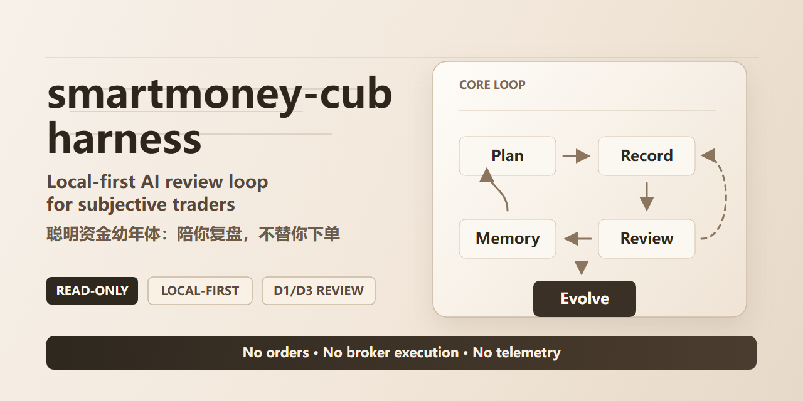

# smartmoney-cub-harness



[](https://www.python.org/)
[](LICENSE)
[](tests/)
[](docs/safety.md)
[](docs/privacy.md)
[](docs/agent-loop.md)

Local-first AI review harness for subjective traders. It records decisions, reviews D1/D3 outcomes, and evolves rules without touching execution.

`smartmoney-cub-harness` 是一个更可信、更好上手、更适合 agent 协作的“聪明资金幼年体 / AI 复盘自进化 Harness”开源项目。它关注只读复盘、决策记录、D1/D3 结果验证、闭环记忆、规则进化和 agent-ready workflow。

它不是荐股机器人，不是券商连接器，不是自动交易系统，也不构成投资建议。

## 5 秒 Demo

```bash
git clone https://github.com/myc0576/smartmoney-cub-harness.git
cd smartmoney-cub-harness
pip install -e ".[dev]"
smcub loop --preset toy --agent-trigger "自进化"
```

这个 demo 只使用 toy offline JSON fixtures。运行后会在本地生成：

- `loop_report.md`
- `trace.jsonl`
- `case_record.json`
- `memory.md`
- `evolution_ledger.jsonl`

输出会包含：

```json
{
  "status": "ok",
  "loop_name": "observe_candidate_plan_position_outcome_review_rule_update",
  "preset": "toy",
  "champion_mutated": false,
  "network_required": false,
  "telemetry": false,
  "safety": "READ_ONLY_NO_ORDER_NO_CANCEL_NO_TRADE"
}
```

## 给普通用户

不需要 API 也能复盘。你可以使用：

- 交易计划文本。
- 交易日志 CSV。
- 同花顺 / 券商截图。
- 只读导出。
- toy offline 示例，先学习闭环形状。

Harness 会帮助你把当时的计划、证据、失效位、时间停止、放弃条件、数据质量、D1/D3 结果、复盘评分、失败标签、本地记忆和规则候选整理成可检查 artifacts。

## 给 Coding Agents

你可以对 agent 说：`loop`、`自进化`、`复盘一下`。

安全的 agent workflow 是：

1. 运行 `smcub loop --preset toy --agent-trigger "自进化"`。
2. 打开 `loop_report.md` 和 `trace.jsonl`。
3. 提出安全、复盘或工作流改进。
4. 只提出 challenger 规则候选。
5. 不得下单、撤单、修改账户、自动化券商，也不得在没有显式人工确认时修改 champion 规则。

见 [docs/agent-loop.md](docs/agent-loop.md)。

## Safety

所有 manifest / decision / outcome / evaluation / registry / doctor / loop 输出都必须保留：

```text
READ_ONLY_NO_ORDER_NO_CANCEL_NO_TRADE
```

默认安全边界：

- local-first。
- offline by default。
- no telemetry。
- no upload。
- no trading execution。
- no broker automation。
- CLI 输出前先 redaction。
- 公开仓库只使用 toy examples。

运行：

```bash
smcub privacy-audit
smcub doctor
```

## Core Loop

```text
Plan -> Observe -> Record -> Outcome -> Evaluate -> Memory -> Rule Candidate
```

5 秒 loop 会完成：

1. run doctor。
2. capture toy decision。
3. build D1 outcome。
4. evaluate run。
5. collect offline case。
6. write local Markdown memory。
7. append evolution ledger event。
8. propose challenger rule update。
9. write `loop_report.md`。
10. write `trace.jsonl`。
11. 明确 `champion_mutated=false`。

## Privacy

本项目不会收集、上传、出售或学习用户的交易逻辑。默认没有服务器、没有遥测、没有远程数据库、没有真实账户连接。

用户的私有交易逻辑只应保留在本地 artifacts 中，不进入公开仓库。公开示例必须只使用 toy offline data。

见 [docs/privacy.md](docs/privacy.md) 和 [docs/public-vs-private-quantkb.md](docs/public-vs-private-quantkb.md)。

## CLI Commands

```bash
smcub loop --preset toy --agent-trigger "自进化"
smcub privacy-audit
smcub inspect-artifacts <run_dir>
smcub collect-case <run_dir>
smcub append-ledger --event EVENT --payload-json FILE
smcub save-memory --case-record FILE
smcub doctor
smcub validate-manifest examples/sample_run/run_manifest.json
```

## Development Checks

```bash
pip install -e ".[dev]"
pytest -q
python -m smartmoney_cub_harness.cli doctor
python -m smartmoney_cub_harness.cli --help
```

## Public Boundary

公开仓库可以包含 schema、loop runtime、toy examples、redaction、case bank、local Markdown memory、evolution ledger、challenger/champion governance 和 agent runbook。

公开仓库不得包含真实交易记录、真实 watchlist、账户数据、私有 QMT 路径、私有策略 prompts、关键选股逻辑、秘密评分权重、credentials、cookies 或本地私有工作区路径。

## License

MIT. See [LICENSE](LICENSE).
