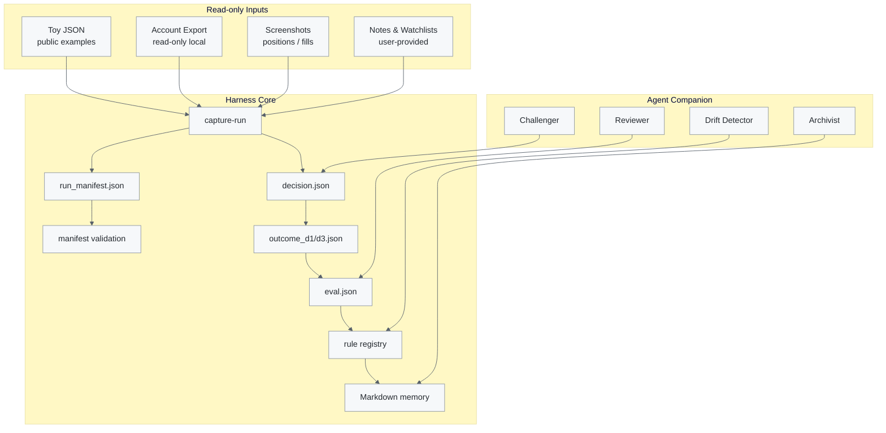

# Architecture

`smartmoney-cub-harness` is a semi-quant AI decision harness for subjective trading review. The public core stays offline and toy-first, but its boundaries are designed around read-only inputs, provenance, delayed outcomes, and rule evolution.

It is not a broker connector or execution layer. Any future account adapter must remain read-only and local.

## Module Map

- `cli.py`: command surface for capture, manifest validation, outcome building, evaluation, registry updates, and doctor output.
- `run_capture.py`: captures offline commands, stores stdout/stderr/meta, writes manifests, and creates decisions.
- `manifest.py`: validates provenance, data quality, and anti-future-leakage constraints.
- `decision.py`: derives `SILENT`, `ALERT`, or `ERROR` and extracts structured toy observation candidates.
- `outcome.py`: builds D1/D3 outcomes from local JSON fixtures.
- `evaluator.py`: checks the safety contract and scores decisions against outcomes and risk controls.
- `registry.py`: keeps challenger rules, promotion recommendations, and explicit champion updates.
- `case_bank.py`: normalizes offline runs into portable case records.
- `evolution_ledger.py`: appends review and rule-evolution events as text records.
- `safety.py`: redacts sensitive keys, emails, phone numbers, and local paths.

## Input Boundary

The architecture allows several input classes, always under review-only semantics:

| Input | Public repo status | Safety boundary |
| --- | --- | --- |
| Toy JSON fixtures | Included | Safe for tests and docs |
| Trading notes | User-provided locally | Do not commit private notes |
| Watchlist files | User-provided locally | Do not commit private watchlists |
| Broker/QMT export | Local read-only extension | Never execute orders or modify accounts |
| TongHuaShun/broker screenshots | User-provided locally | Use for local review and structure extraction only |

Screenshots are a deliberate safety-friendly path: they let a trader review account context without giving the harness execution permissions.

## Decision Artifact Flow

1. **Plan / observe**: user or offline command emits a toy observation candidate, note, or structured context.
2. **Record**: `capture-run` writes `run_manifest.json`, captured artifacts, and `decision.json`.
3. **Validate**: `manifest.py` rejects future leakage and invalid provenance.
4. **Outcome**: `outcome.py` waits for D1/D3 fixture data.
5. **Evaluate**: `evaluator.py` scores the decision and flags risk-contract violations.
6. **Evolve**: `registry.py` keeps rules in challenger state until metrics and explicit confirmation support promotion.
7. **Remember**: case and ledger utilities keep portable text memory rather than private databases.

## Non-Goals

- Live order placement.
- Order cancellation.
- Account modification.
- Broker automation.
- Public examples with real holdings, real trades, real returns, or real stock recommendations.
- Price prediction or signal selling.
