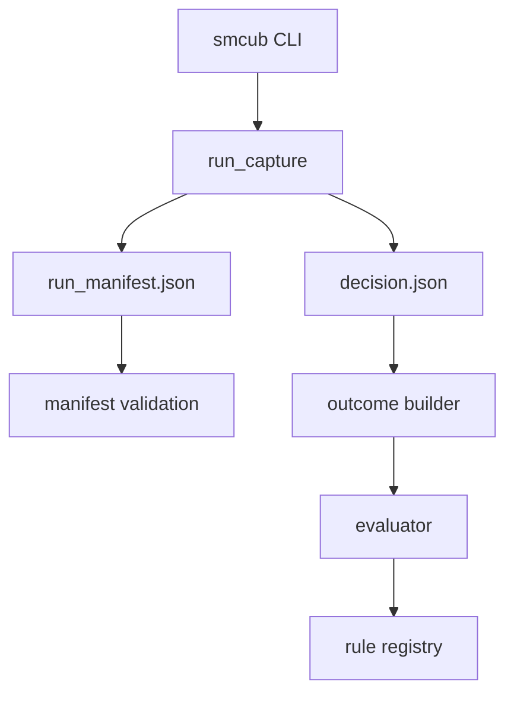

# Architecture

The v0.1 public core is intentionally small and offline.

## Modules

- `manifest.py`: validates provenance and future-leakage constraints.
- `run_capture.py`: runs offline commands, stores stdout/stderr/meta, and creates manifest/decision files.
- `decision.py`: derives SILENT/ALERT/ERROR and extracts a toy observation candidate when JSON stdout is present.
- `outcome.py`: builds D1/D3 outcomes from local JSON fixtures.
- `evaluator.py`: checks the safety contract and scores decisions against outcomes.
- `registry.py`: stores challenger rules and champion state.
- `safety.py`: redacts sensitive keys, emails, phone numbers, and local paths.

## Non-Goals in v0.1

- Live data adapters.
- Broker execution adapters.
- Private knowledge bases.
- Personal trade history import.
- Dashboards.
