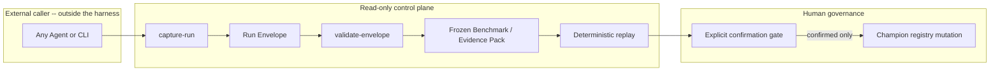
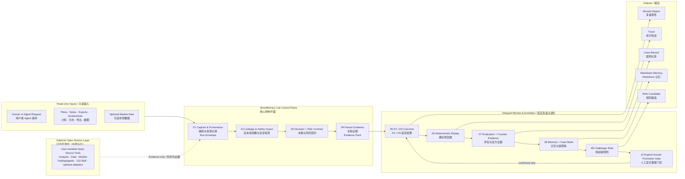

# Architecture

`smartmoney-cub-harness` is a local-first, read-only, agent-agnostic control plane for trading review and evidence governance. An external Agent or CLI can call it, but the caller does not own the resulting provenance, replay, or promotion decision.


```mermaid
flowchart LR
  subgraph Caller["External caller -- outside the harness"]
    A["Any Agent or CLI"]
  end

  subgraph Control["Read-only control plane"]
    C["capture-run"]
    R["Run Envelope"]
    V["validate-envelope"]
    B["Frozen Benchmark / Evidence Pack"]
    P["Deterministic replay"]
  end

  subgraph Governance["Human governance"]
    H["Explicit confirmation gate"]
    G["Champion registry mutation"]
  end

  A --> C --> R --> V --> B --> P --> H
  H -->|"confirmed only"| G
```

The Run Envelope and Evidence Pack are control-plane artifacts outside the external Agent. The caller supplies metadata and offline commands; the harness records the actual results, validates artifact references as portable relative paths, freezes hashes, seals the exact pack manifest bytes, and recomputes evaluation during replay. A passing replay can make evidence eligible for human review, but it cannot mutate the champion registry. Registry mutation remains behind the explicit `register-candidate --confirm-promote` action.

Machine-readable contracts:

- [`schemas/run-envelope.schema.json`](../schemas/run-envelope.schema.json)
- [`schemas/evidence-pack.schema.json`](../schemas/evidence-pack.schema.json)

## Artifact flow

1. `capture-run` executes only the requested offline command or toy preset and writes `run_manifest.json`, `run_envelope.json`, `decision.json`, and captured stdout/stderr metadata.
2. `validate-envelope` checks Agent identity, permissions, evidence paths, tool outcomes, failure counts, and the safety declaration.
3. D1/D3 outcome data is added from a local toy fixture.
4. `build-evidence-pack` freezes the rule candidate plus manifest, decision, outcome, and evaluation for every sample, records SHA-256 hashes and review metrics, and writes `evidence_pack.sha256` over the exact manifest bytes.
5. `replay-evidence-pack` verifies the manifest seal, manifest structure, complete hash inventory, artifact hashes, and deterministic recomputation of validation, evaluation, metrics, and failure state.
6. A human reviews eligible evidence. Rule promotion still requires explicit confirmation.

## Status ownership

| Artifact | Status field | Values | Meaning |
| --- | --- | --- | --- |
| Run Envelope | `status` | `completed`, `pending_review`, `blocked` | Tool-run completion and failure state |
| Evidence Pack | `review_status` | `challenger`, `ready_for_review`, `pending_review`, `blocked` | Frozen evidence readiness for human review |
| Replay report | `evidence_status` | `verified`, `pending_review`, `blocked` | Integrity and deterministic replay result |
| Decision | `action_label` | `SILENT`, `ALERT`, `ERROR`, `WATCH`, `AVOID`, `EMPTY_POSITION` | Recorded observation context, never an order |

Workflow statuses are not trading action labels.

## Bilingual System Pipeline

The README references a bilingual static diagram (`assets/smartmoney-cub-system-flow-bilingual.png`). The maintainable Mermaid source below mirrors the same control-plane pipeline in GitHub's native diagram syntax.


```mermaid
flowchart LR
  subgraph Z1["Read-only Inputs / 只读输入"]
    R["Human or Agent Request<br/>用户或 Agent 请求"]
    N["Plans · Notes · Exports · Screenshots<br/>计划 · 日志 · 导出 · 截图"]
    M["Optional Market Data<br/>可选市场数据"]
  end

  subgraph Z2["Optional Open-Source Layer<br/>可选开源层（外部运行）"]
    O["User-installed Open-Source Tools<br/>Analysis · Data · Models<br/>TradingAgents · UZI-Skill · optional adapters"]
  end

  subgraph Z3["SmartMoney-Cub Control Plane<br/>核心控制平面"]
    N01["01 Capture & Provenance<br/>捕获与来源记录<br/>Run Envelope"]
    N02["02 Leakage & Safety Guard<br/>反未来函数与安全检查"]
    N03["03 Decision + Risk Contract<br/>决策与风险契约"]
    N04["04 Freeze Evidence<br/>冻结证据<br/>Evidence Pack"]
  end

  subgraph Z4["Delayed Review & Evolution / 延迟复盘与进化"]
    N05["05 D1 / D3 Outcome<br/>D1 / D3 延迟结果"]
    N06["06 Deterministic Replay<br/>确定性回放"]
    N07["07 Evaluation + Counter-Evidence<br/>评估与反方证据"]
    N08["08 Memory + Case Bank<br/>记忆与案例库"]
    N09["09 Challenger Rule<br/>挑战者规则"]
    N10["10 Explicit Human Promotion Gate<br/>人工显式晋级门禁"]
  end

  subgraph OUT["Outputs / 输出"]
    Y1["Review Report<br/>复盘报告"]
    Y2["Trace<br/>执行轨迹"]
    Y3["Case Record<br/>案例记录"]
    Y4["Markdown Memory<br/>Markdown 记忆"]
    Y5["Rule Candidate<br/>规则候选"]
  end

  Z1 --> N01
  Z2 -.->|"Evidence only / 仅作为证据"| N01
  N01 --> N02 --> N03 --> N04 --> N05 --> N06 --> N07
  N07 --> N08 --> N09 --> N10
  N10 -->|"confirmed only"| N05
  N05 --> Y1
  N06 --> Y2
  N07 --> Y3
  N08 --> Y4
  N09 --> Y5
```

Feedback from node 10 back to "Next Plan / 下一次计划" passes only through an explicit human confirmation (`smcub confirm-promotion`). Optional open-source tools sit outside the trusted core and contribute review evidence — never order intent.

## Module map

- `run_capture.py`: runs offline commands and writes portable run artifacts.
- `run_envelope.py`: records Agent metadata, actual tool results, output evidence, permissions, and failure state.
- `manifest.py`: validates provenance, data quality, and anti-future-leakage constraints.
- `decision.py`: derives recorded observation labels and required risk context.
- `outcome.py` and `evaluator.py`: build and review delayed D1/D3 toy outcomes.
- `evidence_pack.py`: freezes evidence, hashes artifacts, and performs deterministic replay.
- `registry.py`: stores challengers and enforces explicit champion promotion.
- `safety.py`: redacts sensitive values and local absolute paths.

## Trust boundaries

The public core has no network requirement, embedded LLM, broker access, account mutation, order, cancel, or trade capability. In the Run Envelope, `writes: run_directory_only` and the other denied capabilities are a declarative, explicitly unverified policy (`enforcement: declarative`, `verified: false`). The harness does not sandbox arbitrary captured commands; callers must use an OS/container sandbox when enforcement is required. Separately, harness governance commands may write local evidence and registry artifacts. The pack seal detects local in-place changes but is not an authenticated signature. Champion registry mutation still requires a human to invoke `register-candidate --confirm-promote`. Public fixtures contain toy data only.

Every applicable artifact carries:

```text
READ_ONLY_NO_ORDER_NO_CANCEL_NO_TRADE
```
