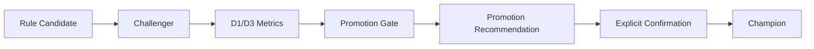

# Evolution Loop

The harness treats rules as reviewable artifacts rather than instant truth.

## Challenger First

New rules are registered as challengers. They can be evaluated, compared, and recommended, but they do not replace champion rules by default.

## Champion Promotion

Promotion requires:

- enough samples;
- low false-alert rate;
- low missed-opportunity rate;
- zero future leakage;
- zero risk-contract violations;
- explicit confirmation.
